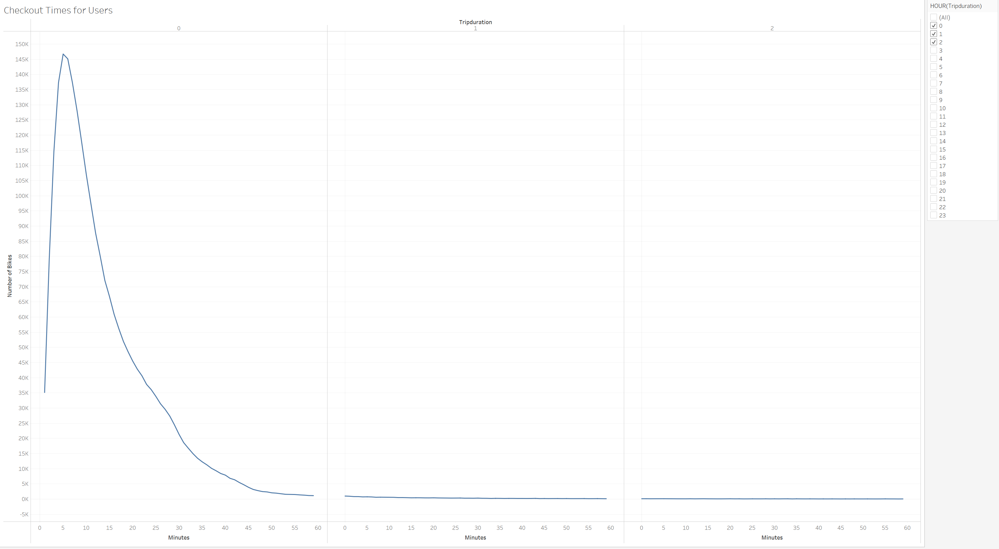
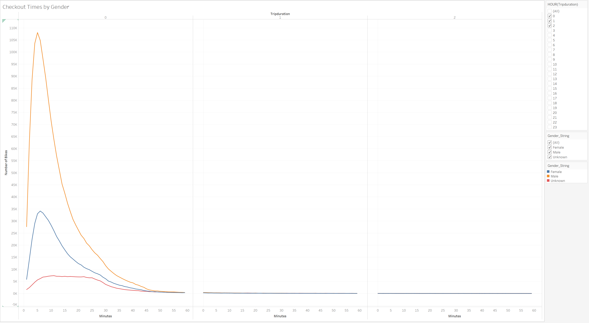
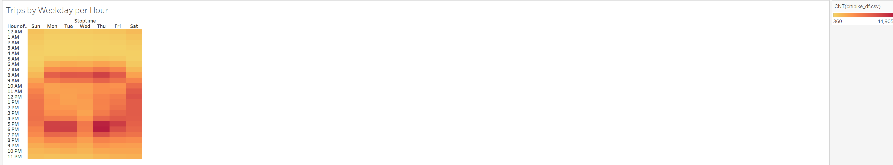
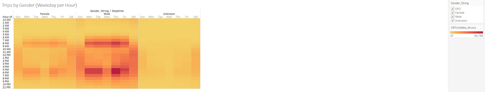
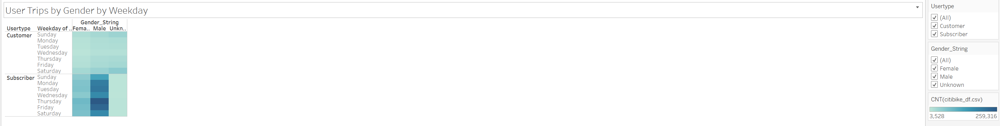
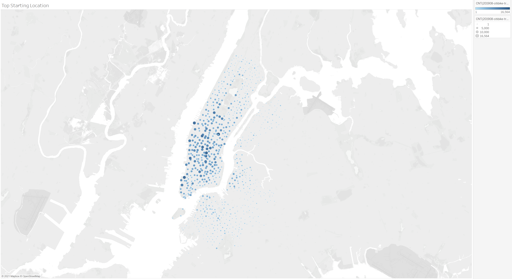
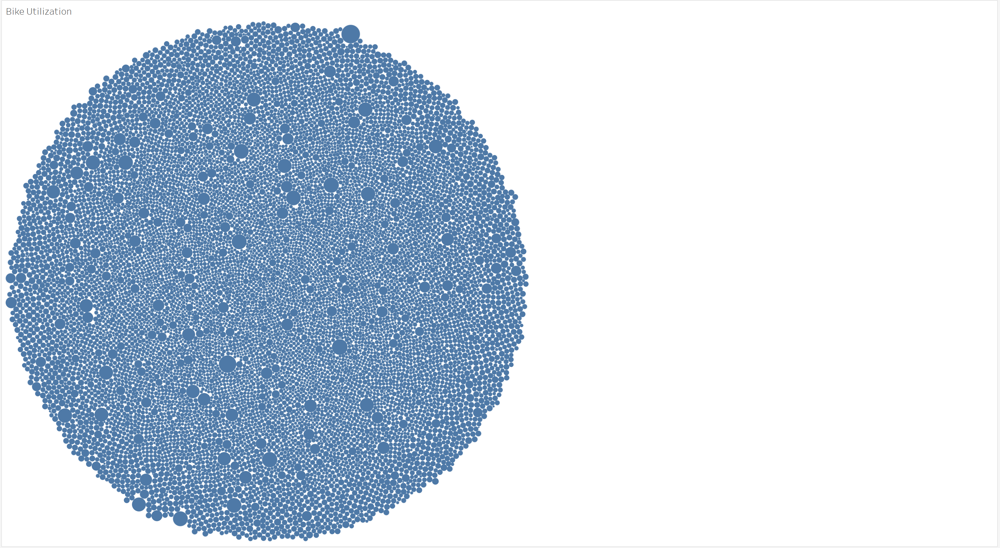

# Citi - Bikesharing
Python Pandas, Tableau
# Overview of the statistical analysis
The project processes datasets using Python Pandas library and export the clean data into Tableau for analysis. Data visualization is conducted for a bike trip analysis to convince investors that such bike-sharing program in Des Moines is a solid business proposal. The analysis below is prepared to pitch to investors for considertaion.  

# Results
  
Majority of the bike users only use bikes for less than 30 minutes.  

  
Male users have much more usage of bikes compared to the other two genders.  

  
It can be noticed that the majority of users prefer to bike early in the morning (6A.M. ~ 9A.M.) or later in the afternoon (4P.M. ~7P.M.)  

  
Male users have more biking acticities during 6A.M. ~ 9A.M. and 4P.M. ~7P.M. duing weekdays and same pattern applies to female users.  

  
Majority of the bike users are male subscribers and they bike more often duing weekdays compared to weekends.  

  
From the image of popular start location, it can be noticed that people use bikes in the middle of Manhattan area compared to other regions.  

  
The images illustrates the using times for each bike (the larger the circle the more time this bike is used). In general, all the bikes are used evenly.  

# Summary
Based on the frequency of bike usage and the preference demonstrated through the graphs, it is generally a solid business proposal.  
1. More visualization could be conducted to see the age group (by creating different age bins) has the highest interest in biking.  
2. More analysis can be done to see which "start stations" have more users so that more resources/bikes can be put to adapt the market demand.  
